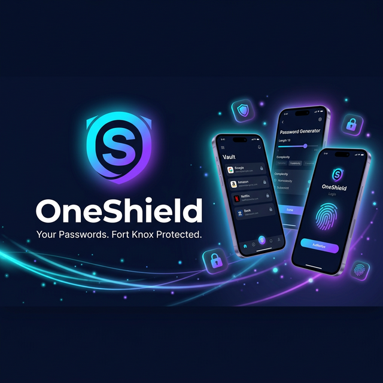
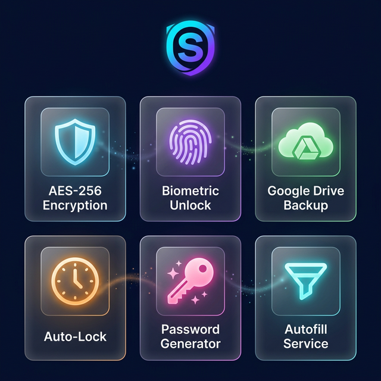

<p align="center">
  
</p>

<h1 align="center">OneShield</h1>
<p align="center">
  <strong>Your Passwords. Fort Knox Protected.</strong>
</p>

<p align="center">
  
  
  
  
</p>

---

<p align="center">
  
</p>

## 📥 Download

<p align="center">
  <a href="https://github.com/masudranaxpert/OneShield/releases/latest">
    
  </a>
</p>

<p align="center">
  <a href="https://github.com/masudranaxpert/OneShield/releases/latest">
    
  </a>
  <a href="https://github.com/masudranaxpert/OneShield/releases/latest">
    
  </a>
  <a href="https://github.com/masudranaxpert/OneShield/actions/workflows/build.yml">
    
  </a>
</p>

> **How to install:** Download `OneShield.apk` from [latest release](https://github.com/masudranaxpert/OneShield/releases/latest) → Open → Tap "Install" → If Play Protect warns, tap **"More details"** → **"Install anyway"**

---

## 🛡️ What is OneShield?

**OneShield** is a fully offline, military-grade password manager built with Flutter. All your passwords, credit cards, secure notes, and personal IDs are encrypted with **AES-256** and stored locally on your device — never on any server.

Unlike cloud-based managers, OneShield gives you **100% control** over your data. Your encryption keys are protected by the **Android Hardware Keystore**, making them impossible to extract — even with root access.

---

## ✨ Features

<p align="center">
  
</p>

### 🔐 Security
| Feature | Description |
|---------|-------------|
| **AES-256-CBC Encryption** | Every field individually encrypted with military-grade AES |
| **PBKDF2 Key Derivation** | 100,000 iterations of HMAC-SHA256 — brute force resistant |
| **Encrypted Database** | Hive boxes encrypted at rest with Android Keystore key |
| **Hardware-Backed Keys** | Encryption keys stored in hardware security module (TEE) |
| **Auto-Lock** | Vault locks after 30 seconds in background |
| **Clipboard Auto-Clear** | Sensitive data cleared from clipboard after 30 seconds |
| **Zero-Knowledge** | Master password never stored — only SHA-256 hash with salt |

### 📱 Vault Categories
- 🔑 **Passwords** — Websites, apps, accounts
- 💳 **Credit Cards** — Card details with CVV encryption
- 📝 **Secure Notes** — Private text with full encryption
- 👤 **Personal IDs** — Identity documents and info

### 🔄 Backup & Sync
- ☁️ **Google Drive Backup** — Encrypted backup to your Drive
- 📁 **Local Backup** — Export/import encrypted `.vpb` files
- 🔄 **Auto Backup** — Schedule daily backups
- 📊 **Storage Quota** — See Drive storage usage

### 🔓 Authentication
- 🔒 **Master Password** — Strong password with PBKDF2
- 📱 **Device Auth** — PIN, Pattern, Fingerprint, Face unlock
- 🔑 **Password Recovery** — Security questions with hashed answers
- ⏱️ **Rate Limiting** — 3 recovery attempts per day

### 📋 Autofill
- 🌐 **Browser Autofill** — Works in Chrome, Firefox, and all browsers
- 📱 **App Autofill** — Auto-fill in any Android app
- 🔐 **Auth Required** — Device authentication before filling
- 🔄 **Auto Sync** — Credentials synced on vault unlock

### ⚡ Other Features
- 🎲 **Password Generator** — Cryptographically secure random passwords
- ⭐ **Favorites** — Quick access to frequent entries
- 🔍 **Search** — Instant search across all entries
- 🏷️ **Tags** — Organize with custom tags

---

## 🏗️ Architecture

```
Master Password
      │
      ▼
PBKDF2-HMAC-SHA256 (100K iterations)
      │
      ▼
256-bit Encryption Key
      │
      ├── Each field → AES-256-CBC encrypted
      ├── Biometric → Key in Android Keystore (HW)
      └── Recovery → Key encrypted with security answers

Hive Database → AES encrypted (Keystore key)
Autofill Store → EncryptedSharedPreferences (AES-256-GCM)
```

---

## 🚀 Getting Started

### Prerequisites
- Flutter 3.x+
- Android SDK 26+ (Android 8.0 Oreo)
- Android device or emulator

### Installation

```bash
# Clone the repository
git clone https://github.com/yourusername/oneshield.git
cd oneshield

# Install dependencies
flutter pub get

# Generate Hive adapters (if changed models)
flutter packages pub run build_runner build

# Run on device
flutter run
```

### Build Release APK

```bash
flutter build apk --release
```

---

## 📁 Project Structure

```
lib/
├── core/
│   ├── constants.dart          # App-wide constants
│   └── theme.dart              # Dark theme & design tokens
├── models/
│   ├── vault_entry.dart        # Password entry model
│   ├── master_config.dart      # Master password config
│   └── backup_config.dart      # Backup settings model
├── screens/
│   ├── login_screen.dart       # Master password & biometric login
│   ├── setup_screen.dart       # First-time setup wizard
│   ├── home_screen.dart        # Main vault & password generator
│   ├── entry_detail_screen.dart # View/edit entry details
│   ├── add_entry_screen.dart   # Add new vault entry
│   └── settings_screen.dart    # Settings, backup, autofill
├── services/
│   ├── vault_service.dart      # Core vault operations & encryption
│   ├── crypto_service.dart     # AES-256, PBKDF2, hashing
│   ├── drive_backup_service.dart # Google Drive OAuth2 & backup
│   └── autofill_bridge.dart    # Flutter ↔ Native autofill bridge
├── widgets/
│   └── common_widgets.dart     # Reusable UI components
└── main.dart                   # App entry point & auto-lock

android/app/src/main/kotlin/com/oneshield/app/
├── MainActivity.kt             # Flutter engine & method channels
├── OneShieldAutofillService.kt  # Native Android autofill service
└── AutofillAuthActivity.kt     # Auth before autofill
```

---

## 🔒 Security Model

| Attack Vector | Protected | How |
|--------------|-----------|-----|
| Phone stolen (locked) | ✅ | Device lock + encrypted DB |
| Phone stolen (app open) | ✅ | 30s auto-lock + key wipe |
| Root access | ✅ | Keys in hardware Keystore |
| File system dump | ✅ | Hive boxes AES encrypted |
| Clipboard sniffing | ✅ | Auto-clear after 30s |
| Logcat monitoring | ✅ | No sensitive data logged |
| Brute force | ✅ | PBKDF2 100K iterations |
| Recovery abuse | ✅ | 3 attempts/day rate limit |

---

## 🛠️ Tech Stack

| Component | Technology |
|-----------|-----------|
| Framework | Flutter 3.x (Dart) |
| Local Database | Hive (encrypted) |
| Encryption | AES-256-CBC, PBKDF2, SHA-256 |
| Secure Storage | flutter_secure_storage (Android Keystore) |
| Authentication | local_auth (Biometric/PIN/Pattern) |
| Cloud Backup | Google Drive API v3 (OAuth2) |
| Autofill | Android AutofillService API |
| Native Bridge | MethodChannel (Flutter ↔ Kotlin) |

---

## 📝 License

This project is private and proprietary.

---

<p align="center">
  
  <br/>
  <strong>OneShield</strong> — Because your passwords deserve a fortress.
</p>
